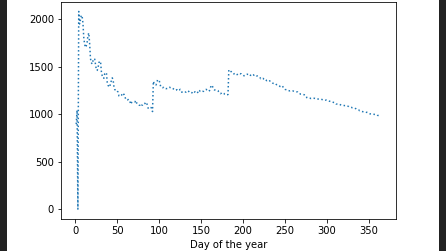
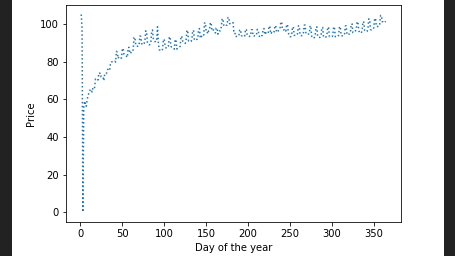
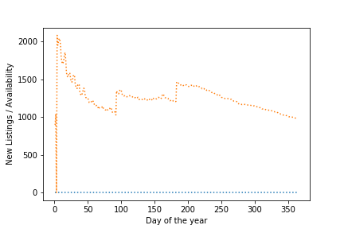

# Airbnb-Boston-Data-Visualisation

###### Question 1:
###### Can you describe the vibe of each Boston neighborhood using listing descriptions?

Approach:
The input file contains one column called description which has the description of the Airbnb guests about their experience in the Airbnb stay. I used the Python Natural Language Toolkit (NLTK) library for getting the results. The description column would cluster around descriptive words thereby giving us the vibe of each Boston neighbourhood. Clustering can help find common cluster centers, defining the vibe of the Boston neighbourhood. In the output file I have a words defining the vibe of the neighbourhood. Here I have performed the summarisation and tokenization of listing description. [Here](https://www.kaggle.com/bnsmith3/phrases-that-charactertize-each-neighborhood) is the reference that I used to get the vibe. 

###### Question 2:
###### What are the busiest times of the year to visit Boston? By how much do prices spike?

Approach:
1) For busiest times of the year: 
From one of the files, I get the dates in the format YYYYMMDD and get information regarding whether the hotel is available or not. I first convert all the dates in the given format to day of the year. For example, 3th February 2016 will be written as "34". Period with the global maxima would be my busiest period. Using this, I plotted the availability and identified the busiest period of the year. The availability options are given as 't' for available and 'f' for not available. I plot this availability data against the converted day of the year and plot the graph. The maximum number of points in the 'f', which is unavailable section will give me the busiest time of the year. 

2) For price spike:
In the same file, keeping the x-axis date convertion the same, I plotted the average price of the hotels on the y-axis. the highest average price spikes upto $120. The period with the spike is day 345 to day 365 of the year. This is equivalent to December 11, 2016 to 31st December, 2016, which is the Christmas vacation period.

###### Question 3:
###### Is there a general upward trend of both new Airbnb listings and total Airbnb visitors to Boston?

Approach: Using listings, I tried to find when a new listing was enlisted. I extracted new listings by tracking all the old listings and found that there were no new listings in the dataset. I would have used market basket associativity rules to find out if the upward trend of new listings popping had any relation to increase in customer base, in case there would have been new listings in the dataset. After a quick analysis, I conclude that there are no new listings in the available dataset. Hence we cannot find any trend that might exist between the new Airbnb listings and the total Airbnb visitors to Boston.

###### Question 4:
###### Given the context and data, what kind of machine learning techniques can be used to address the problem?

Approach: The machine learning technique used for question 1 to get the vibe of the data involves Natural Language Processing (NLP), where each word in sentences of the "description" column gave a sentiment of each of the Airbnb guest. The first step was to tokenize sentences to break them into words and get the tokens of the text.

Sentiment analysis, which is a part of NLP, is a technique that extracts the sentiment behind the opinions of people. Using this technique, one can also find what factors contribute to the bad reviews and what contribute to the good ones, to get the overall vibe of neighbourhood. In question 2, for both the parts of busiest times and price hike, a time series analysis was performed. This technique deals with time series data or trend analysis. It is used in  forecasting, monitoring or even feedback and feedforward control. This technique showed the trend of availability of Airbnb rooms and price with respect to dates.

References: 
1. https://en.wikipedia.org/wiki/Sentiment_analysis
2. https://en.wikipedia.org/wiki/Natural_Language_Toolkit
3. https://www.quora.com/What-is-the-relation-between-sentiment-analysis-natural-language-processing-and-machine-learning
4. https://www.kaggle.com/bnsmith3/phrases-that-charactertize-each-neighborhood
5. https://www.itl.nist.gov/div898/handbook/pmc/section4/pmc41.htm

